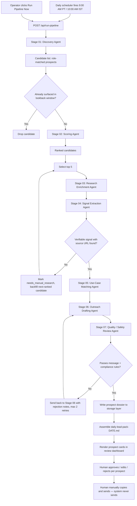

# AGENT_FLOWS.md — Architecture, Prompts, and Orchestration

This file defines the 7-stage pipeline behind the Lead Personalization Agent, the daily scheduler that drives it, the shared safety core every prompt inherits, the data-source rules, and the storage schema. It follows the same pattern as the Growth Engine's `AGENT_FLOWS.md`: the browser never talks to the model provider directly, all calls go through a server-side route, and the API key never leaves the server.

## 1. Architecture Overview



The pipeline runs all 5 prospect slots through Stages 03–07 independently and in parallel where the provider allows it; a single prospect's failure (e.g., research enrichment fails) does not fail the run — that slot is marked `needs_manual_research` and backfilled if a next-ranked candidate exists.

---

## 2. Model Selection

| Stage | Primary model | Fallback model | Temp | Max tokens | Reasoning |
|---|---|---:|---:|---:|---|
| 01 Discovery | `groq/compound` | `llama-3.3-70b-versatile` | 0.3 | 2000 | Needs live web search to find current role-matched candidates. |
| 02 Scoring | `llama-3.3-70b-versatile` | `llama-3.1-8b-instant` | 0.2 | 1200 | Needs consistent, arithmetic-style scoring, not creativity. |
| 03 Research Enrichment | `groq/compound` | `llama-3.3-70b-versatile` | 0.3 | 2200 | Needs live web grounding on the company and prospect. |
| 04 Signal Extraction | `groq/compound` | `llama-3.3-70b-versatile` | 0.2 | 1400 | Needs current, verifiable, dated public content. |
| 05 Use-Case Matching | `llama-3.3-70b-versatile` | `llama-3.1-8b-instant` | 0.3 | 1000 | Deterministic mapping task, low creativity needed. |
| 06 Outreach Drafting | `llama-3.3-70b-versatile` | `llama-3.1-8b-instant` | 0.7 | 1600 | Drafting-heavy; needs natural, specific, varied writing. |
| 07 Quality / Safety Review | `llama-3.3-70b-versatile` | `llama-3.1-8b-instant` | 0.1 | 1200 | Needs strict, consistent rule-checking, not creativity. |

Search-dependent stages (01, 03, 04) use `groq/compound` first because they require current public information; drafting and scoring stages do not need live search and use a faster, cheaper model.

---

## 3. Request / Response Contract

```json
POST /api/run-pipeline
Content-Type: application/json

{
  "trigger": "scheduled" | "manual",
  "targetRoles": [
    "Healthcare Practice Manager",
    "Revenue Cycle Owner",
    "Patient Access Leader",
    "RCM Director",
    "Billing Operations Leader",
    "Healthcare Operations Leader",
    "Practice Administrator"
  ],
  "manualInputs": {
    "linkedinUrlsOrPastedActivity": "string optional, newline-separated",
    "crmLeadListCsv": "string optional, raw CSV"
  },
  "lookbackDays": 45
}
```

Per-stage internal contract (each stage calls the model route independently):

```json
POST /api/agent
Content-Type: application/json

{
  "stage": "discovery" | "scoring" | "research" | "signal" | "usecase" | "drafting" | "review",
  "prospectContext": { "...partial dossier built so far..." },
  "runId": "2026-06-20"
}
```

Success:

```json
{
  "ok": true,
  "stage": "signal",
  "output": { "...stage-specific structured fields..." },
  "model": "groq/compound",
  "fallbackUsed": false,
  "sourcesUsed": ["https://...", "https://..."],
  "note": "only present when fallback lost live web-search capability"
}
```

Failure:

```json
{ "ok": false, "stage": "research", "error": "human-readable message" }
```

---

## 4. Shared Safety Core

Every stage prompt interpolates this block, unchanged:

```text
Hard rules you must always follow, with no exceptions:
1. You only research, score, and draft. You never send, post, comment, like, follow, connect, message, or take any other action on LinkedIn, email, or any other platform. You have no ability to do so and must never imply otherwise.
2. You never scrape LinkedIn, never automate a logged-in LinkedIn session, and never reference, simulate, or imply access to private or login-gated LinkedIn data. You only use public, non-logged-in sources, CRM-provided lead lists, or content explicitly supplied by the operator (manually pasted profile URLs or activity text).
3. You never invent a recent activity, post, job change, quote, statistic, or company fact. Every signal you use must resolve to a real, specific, fetchable public source URL with a determinable date. If you cannot find one, say so plainly and do not substitute a guess.
4. You never recommend or describe automated LinkedIn or email activity: no auto-connect, auto-DM, auto-comment, auto-like, auto-follow, scraping, bots, proxies, or browser automation.
5. You never process, request, store, or reference patient data or protected health information (PHI). You only work with public company, role, and professional-activity data.
6. You do not make clinical, medical, compliance, security, or ROI claims in outreach copy beyond what is explicitly supplied or publicly verifiable.
7. You always output structured data in the exact schema requested for your stage — no preambles, no meta commentary, no markdown outside the requested fields.
```

---

## 5. Stage Prompts and Schemas

### Stage 01 — Discovery Agent

**Behavior:** Search public sources for individuals currently in the target roles at healthcare provider organizations, using search terms built from `targetRoles`. Also ingest any `manualInputs` directly as candidates.

**Output schema:**

```json
{
  "candidates": [
    {
      "name": "string",
      "title": "string",
      "company": "string",
      "companyWebsite": "string or null",
      "linkedinUrl": "string or null",
      "discoverySourceUrl": "string",
      "discoveryMethod": "search" | "manual_input" | "crm_list"
    }
  ]
}
```

Candidates without a `name` and `company` resolvable from a real source are dropped, not guessed.

---

### Stage 02 — Scoring Agent

**Behavior:** Score each surviving (post-dedup) candidate 0–100 on fit, using the weighted criteria from `PRD.md` Section 9, and return the top 5 plus the next 5 as backfill reserve.

**Output schema:**

```json
{
  "scored": [
    {
      "candidateRef": "string id from discovery output",
      "fitScore": 0,
      "fitBreakdown": {
        "roleRelevance": 0,
        "companyFit": 0,
        "rcmComplexity": 0,
        "patientAccessRelevance": 0,
        "recentTriggerStrength": 0,
        "personalizationQuality": 0,
        "publicSourceConfidence": 0,
        "voicecareUseCaseFit": 0,
        "seniorityInfluence": 0,
        "signalTimeliness": 0
      },
      "rank": 0
    }
  ],
  "selectedTop5": ["candidateRef", "..."],
  "backfillReserve": ["candidateRef", "..."]
}
```

`fitScore` is a weighted sum; weights are configurable but default to equal weighting (10 points max per criterion). Scoring happens *before* signal extraction using whatever discovery-stage detail is available, and is re-validated after research enrichment in Stage 04 once a real signal is confirmed.

---

### Stage 03 — Research Enrichment Agent

**Behavior:** For each of the 5 selected candidates, gather public detail: company size/type signals, recent company news, the candidate's public professional background, and anything indicating RCM/patient-access operational complexity.

**Output schema:**

```json
{
  "candidateRef": "string",
  "companyProfile": "2-4 sentence summary, grounded in sources",
  "operationalSignals": ["string", "..."],
  "sourcesUsed": ["https://...", "..."]
}
```

If enrichment fails or returns nothing usable, the candidate is marked `needs_manual_research` and the pipeline attempts a backfill candidate from `backfillReserve`.

---

### Stage 04 — Signal Extraction Agent

**Behavior:** From the research output, identify the single strongest recent (target: last 30–60 days, but explicitly state actual age if older), verifiable signal. Reject anything without a determinable date and a direct source URL.

**Output schema:**

```json
{
  "candidateRef": "string",
  "signal": {
    "type": "post" | "job_change" | "news" | "hiring" | "conference" | "podcast" | "press_release" | "website_update" | "other",
    "description": "string, factual, no editorializing",
    "sourceUrl": "https://...",
    "dateObserved": "YYYY-MM-DD or best-known approximation",
    "ageInDays": 0
  },
  "signalFound": true,
  "confidenceScore": 0
}
```

If `signalFound` is `false`, the candidate is routed to `needs_manual_research` and excluded from the day's 5; the next backfill candidate re-enters at Stage 03.

---

### Stage 05 — Use-Case Matching Agent

**Behavior:** Map the confirmed signal and operational profile to exactly one primary VoiceCare AI use case (and optionally one secondary), drawn only from the approved list: reducing payer hold times, automating claims status follow-ups, automating eligibility verification, supporting prior authorization follow-ups, reducing manual RCM workload, improving patient access operations, reducing repetitive billing operations work, scaling healthcare admin workflows without adding headcount.

**Output schema:**

```json
{
  "candidateRef": "string",
  "painHypothesis": "1-2 sentences, grounded in operationalSignals + signal",
  "primaryUseCase": "string from approved list",
  "secondaryUseCase": "string from approved list or null",
  "whyRelevant": "1-2 sentences connecting signal to pain hypothesis"
}
```

---

### Stage 06 — Outreach Drafting Agent

**Behavior:** Generate three message formats, each referencing the confirmed signal naturally and tying it to the matched use case. Never invent details beyond what Stages 03–05 produced.

**Required message rules (apply to all three formats):**

```text
- Sound human and specific, not templated.
- Be concise; no filler.
- No generic AI phrasing ("I hope this finds you well", "I came across your profile", "In today's fast-paced healthcare landscape").
- No fake familiarity ("Great to connect!" when there has been no prior contact).
- No unsupported claims, no invented statistics, no promised ROI or compliance outcomes.
- Reference the specific signal naturally, not as a bolted-on opener.
- Explain briefly why VoiceCare AI is relevant to that company's situation.
- End with a soft, low-pressure CTA (e.g., "open to a quick conversation if useful" — never "let's hop on a call this week").
```

**Output schema:**

```json
{
  "candidateRef": "string",
  "connectionNote": { "text": "string", "charCount": 0 },
  "followUpMessage": { "text": "string", "wordCount": 0 },
  "coldEmail": { "subject": "string", "text": "string", "wordCount": 0 },
  "followUpDraft2": { "text": "string", "wordCount": 0 }
}
```

Format constraints: connection note under 300 characters; follow-up message 80–120 words; cold email 120–160 words with subject line.

---

### Stage 07 — Quality / Safety Review Agent

**Behavior:** Independently check every draft from Stage 06 against the message rules, the shared safety core, and source traceability. This stage does not rewrite messages — it approves or rejects with specific reasons, sent back to Stage 06 for revision (max 2 retries before the prospect is flagged `needs_manual_research` instead of auto-approved).

**Output schema:**

```json
{
  "candidateRef": "string",
  "passed": true,
  "checks": {
    "noFabricatedClaim": true,
    "everyClaimSourced": true,
    "noGenericAiPhrasing": true,
    "noFakeFamiliarity": true,
    "noOverpromisedOutcome": true,
    "ctaIsLowPressure": true,
    "formatConstraintsMet": true,
    "noLinkedInAutomationImplied": true
  },
  "rejectionNotes": ["string, only present if passed is false"]
}
```

A prospect only reaches the human review queue after `passed: true`. This is a machine pre-check, not a substitute for the human review checklist in `DESIGN.md` — both gates are required.

---

## 6. Deduplication Logic

Before a candidate from Stage 01 reaches Stage 02, check the storage layer for any prospect with the same normalized name **and** company surfaced within `lookbackDays` (default 45). Matches are dropped silently from that day's candidate pool (logged, not surfaced as an error). This prevents the same person being re-pitched daily if they weren't approved/sent, while still allowing re-surfacing after enough time has passed or a stronger new signal appears.

A secondary fuzzy check (normalized LinkedIn URL match, if present) catches name-spelling variants.

---

## 7. Confidence Scoring

`confidenceScore` (0–100, set in Stage 04) reflects how certain the system is that the signal and supporting facts are accurate and current — independent of `fitScore`, which reflects how good a target the prospect is regardless of signal certainty.

| Confidence band | Meaning | Routing |
|---|---|---|
| 80–100 | Signal from a primary source (company site, official press release, the prospect's own post) with a clear date | Proceeds normally |
| 50–79 | Signal corroborated by a secondary source (news aggregator, indirect mention) or date is approximate | Proceeds, flagged for extra human scrutiny in the review checklist |
| Below 50 | Signal is weak, single-sourced from a low-reliability source, or date can't be confirmed | Routed to `needs_manual_research`, excluded from the day's 5 |

---

## 8. Data Sources

**Allowed:**

- Google/Bing search results and search-engine-indexed snippets where legally and technically accessible.
- Company websites, healthcare system leadership/team pages.
- Press releases and news articles.
- Job postings.
- Conference speaker pages, podcast pages, webinar pages, public interviews.
- Public professional bios.
- CRM-provided lead lists.
- Manually supplied LinkedIn profile URLs or copied LinkedIn activity text (operator-pasted, never scraped).

**Disallowed:**

- Any logged-in or login-gated LinkedIn page or data.
- LinkedIn scraping or Sales Navigator scraping in any form.
- Browser automation that interacts with LinkedIn.
- Paid third-party scraping/enrichment databases not explicitly licensed for this use.
- Any source that requires bypassing a paywall, CAPTCHA, or access restriction.

**Crawling rules:** respect `robots.txt`, apply reasonable rate limits per domain, and identify the crawler honestly in its user agent. Never crawl LinkedIn directly under any circumstance, including indirectly via a cache or mirror.

**Source reliability ranking (high to low):** prospect's own post/company's own page > official press release > established news outlet > conference/podcast host page > job posting > general news aggregator > unverified third-party blog.

**Freshness rule:** a signal older than 90 days is treated as stale and excluded unless no fresher signal exists and the prospect's fit score is otherwise very strong — in that case it is still flagged `older_signal` in `riskNotes` for human visibility, never hidden.

**Citation requirement:** every `sourceUrl` stored with a dossier must be the literal URL fetched, not a search-results page, and must be re-resolvable by a human reviewer.

---

## 9. Storage Schema

**`prospects` table**

| Field | Type |
|---|---|
| id | uuid |
| run_date | date |
| name, title, company, company_website, linkedin_url | text |
| fit_score, confidence_score | integer |
| signal_type, signal_description, signal_source_url, signal_date | text/date |
| pain_hypothesis, primary_use_case, secondary_use_case, why_relevant | text |
| status | enum: needs_review / approved / edited_approved / rejected / needs_manual_research |
| risk_notes | text |
| created_at, reviewed_at | timestamp |

**`messages` table**

| Field | Type |
|---|---|
| id | uuid |
| prospect_id | uuid (FK) |
| format | enum: connection_note / follow_up / cold_email |
| subject | text (cold email only) |
| body | text |
| was_edited_by_human | boolean |

**`sources` table**

| Field | Type |
|---|---|
| id | uuid |
| prospect_id | uuid (FK) |
| url | text |
| used_for | enum: discovery / research / signal |
| fetched_at | timestamp |

**`run_history` table**

| Field | Type |
|---|---|
| id | uuid |
| run_date | date |
| trigger | enum: scheduled / manual |
| status | enum: success / partial_failure / failure |
| prospects_surfaced | integer |
| stage_log | jsonb |
| started_at, completed_at | timestamp |

**`dedup_index` table**

| Field | Type |
|---|---|
| id | uuid |
| normalized_name | text |
| normalized_company | text |
| linkedin_url | text nullable |
| last_surfaced_date | date |

Recommended backend: Supabase (Postgres, fits this schema directly). Acceptable no-code alternative for the MVP: Airtable or Google Sheets, with the same field structure mapped to one sheet/table per entity above.

---

## 10. Full Daily Orchestration

1. Scheduler (or manual trigger) calls `/api/run-pipeline`.
2. Stage 01 runs once for the whole batch, producing a candidate pool.
3. Dedup filter removes recently-surfaced candidates.
4. Stage 02 scores and ranks the remaining pool; top 5 selected, next 5 held as backfill reserve.
5. Stages 03 → 04 run per selected candidate. Any candidate failing Stage 04 (`signalFound: false`) is replaced from the backfill reserve, which re-enters at Stage 03.
6. Once 5 candidates have a confirmed signal (or the backfill reserve is exhausted, in which case fewer than 5 are surfaced — never padded), each proceeds through Stage 05 → 06 → 07 independently.
7. Stage 07 failures send the candidate back to Stage 06 (max 2 retries), then to `needs_manual_research` if still failing.
8. Every passing prospect is written to storage with full source citations.
9. The combined `daily-lead-pack-DATE.md` is assembled:

```text
# Daily Lead Pack — YYYY-MM-DD

## Run Summary
Prospects surfaced, prospects needing manual research, run duration, any fallback notices.

## Prospect 1 ... 5
Full 17-field dossier + 3 message formats + sources + risk notes.

## Human Review Checklist (per prospect)
## Compliance Checklist
```

10. The review dashboard renders the prospect cards from storage (not from the raw pipeline response), so a page refresh always reflects the latest reviewed state.
11. Nothing in this pipeline sends, posts, connects, or messages on any platform — that action is exclusively human, exclusively manual, every time.

---
